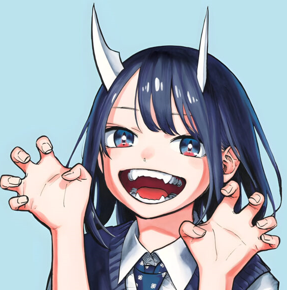

# Franco Cerantonio

    Hola, me llamo Franco, mis amigos me suelen decir **Fran** o **Frani**, tengo 22 años a nada de cumplir 23.

    Desde los 6 años que me interesan las computadoras, me la pasaba jugando a cs y argentum online, por lo que  
    siempre pense que me iba a gustar programar, pero debido a que no sabia por donde empezar y que un amigo me
    habia dicho que no era lo mismo que jugar a la computadora, nunca me anime a intentarlo. Hasta que en la pandemia, 
    aburrido en mi casa, me decidi a intentar aprender algun lenguaje. 

    Me acuerdo que hice un par de desafios de digital house en la plataforma mumuki con gobstone, la verdad que desde ahi me encanto programar y me decidi a anotarme en alguna carrera.

    Por circustancias de la vida no pude anotarme hasta el 2023. Ahora ya habiendo cursado 3 cuatrimestres, se que es lo que me gusta 
    e interesa para mi futuro, espero seguir aprendiendo y adentrandome en este mundo. 

## Hobbys

    Hoy en dia sigo jugando counter, mi juego favorito desde chico, aunque juego un poco de todo, me gusta en especial los rpgs como los baldurs viejos o los pillars of eternity.

    Tambien leo bastante manga, en general me gustan mucho del genero slice of life, actualmente mangas que recomiendo de este genero son Ruri Dragon(https://mangadex.org/title/141609b6-cf86-4266-904c-6648f389cdc9/ruri-dragon) y Ogami Tsumiki to Kinichijou(https://mangadex.org/title/df361a38-eef6-4674-bec6-86d08aa1d1aa/ogami-tsumiki-to-kinichijou)

